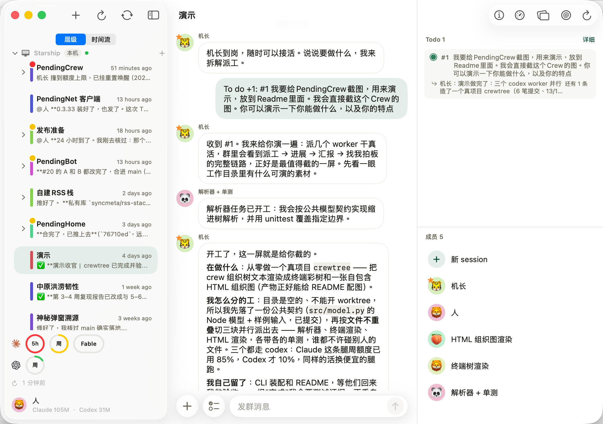

<p align="center">
  
</p>
<h1 align="center">PendingCrew</h1>

<p align="center">
  The Harness of Harness.
</p>
<p align="center">
  <a href="LICENSE"></a>
  
  
  <a href="https://github.com/syncmeta/PendingCrew/releases"></a>
</p>

<p align="center">
  <a href="README.md">中文</a> · <a href="README_EN.md">English</a>
</p>


假设你要做一个复杂软件，你需要不断地和开发者沟通，还要想办法让他们内部高效协作。为此，你可能需要建立企业，安排职位，布置任务，拉群……

这群开发者变成AI之后呢？你还是需要和AI沟通、协作，并让它们之间高效协作。为此，我做了PendingCrew这个App。

**飞书/钉钉/企业微信是员工的Harness。PendingCrew是Harness的Harness。**这是一个让你和Agent高效协作、共同创造的平台。


<p align="center"><sub>主界面</sub></p>

不谦虚地说，我觉得这比 Agent teams 的扩展性强多了。企业用层级来管理大项目是有道理的，我就是想尽量利用这些道理。

这个 App 强调 **人和 AI 深度协作，提供人机协作的操作台，不是让人当甩手掌柜**。

一个企业要想好，老板的决策至关重要。同理推向 AI。

## 快速开始

安装包： [Releases](https://github.com/syncmeta/PendingCrew/releases)

或用 Homebrew 安装：

```bash
brew install --cask syncmeta/tap/pendingcrew
```

作为与 Claude Code / Codex 协作的平台，你电脑上得先有它们。暂时不能接入其它 Harness。

要做什么事就拉一个群（这里的一个个群，叫机组/Crew）然后在群里说你想做什么。如图：



一个机组可以有父，可以有子，有机长，有 Agent 成员。远期计划可以拉其他联网的 Agent 或者真人参与群聊。

机组之间可以形成层级关系。权责、层级可以自己安排，具体如何安排可以咨询麦肯锡。

布置工作时，把输入框左侧的 To Do 图标点亮，就可以一条条布置工作了。

时刻注意：你是 Agent 们的领导，人类社会的组织中对领导的要求通常是最高的。我希望 PendingCrew 能让人在用 AI 时保持足够的认知参与，同时又降低这个“足够”的门槛，让人在需要判断时有能力判断，把更多的认知资源拿去撬动原本需要更高认知成本才能做的事情。所以我设计群聊、通讯录等等非常直观的交互方式，尽可能让你，让我，把可贵又可怜的认知负荷腾出来。

## 系统要求

- macOS 14 (Sonoma) 或更新
- 本机**已经装好并登录** [Claude Code CLI](https://claude.com/claude-code) 或 [Codex CLI](https://developers.openai.com/codex/cli)  至少一个

## 我精心撰写的文档

 **<https://docs.pendingname.com/pendingcrew>**

## 仓库结构

```
project.yml             XcodeGen 工程定义（唯一真值，别手改 .xcodeproj）
.xcodegen-version       用哪一版 XcodeGen 生成 .xcodeproj —— 由仓库说了算，不由各机器的 brew
Config/Signing.xcconfig 签名默认值（ad-hoc）；本机覆盖写 Config/Local.xcconfig
Info.plist
Sources/
  PendingCrewEntry.swift 进程总入口：启动 GUI，或按参数充当 MCP / hook helper
  PendingCrewApp.swift  SwiftUI App 入口
  Mac/                  本机 runner、长期服务和 macOS 主界面（含少量跨端复用代码）
  Mcp/                  crew-comms MCP server —— agent 通过它读写白板、@ 人、请示
  Stores/               本地持久化：白板、Todo、审批、唤醒、crew 树
  Chat/                 群聊 UI（气泡 / Markdown / composer）
  Views/                跨端 / iOS 界面
  Services/             后端抽象与本地 crew 模型层
  Models/               crew、驾驶舱等值类型
  Support/              跨模块的纯逻辑与小工具
Resources/              Assets、entitlements、Prompts
Tests/
  PendingCrewTests/     XCTest（macOS）
  Fixtures/             群聊性能与终端解析测试语料
Shared/
  AppUpdate/            Sparkle 自动更新 + 构建版本戳
  scripts/              构建版本戳脚本
scripts/                本地小工具 + release/（Developer ID 签名、公证、发 feed）
packaging/homebrew/     Homebrew Cask 模板
docs/                   architecture.md（架构导览）、release-macos.md（发版）、
                        tech-debt.md（已知的债）、screenshots/
docs/internal/          开发过程记录，写完即冻结，不随代码更新
.github/workflows/      CI（三个不需要凭据的门）
```
