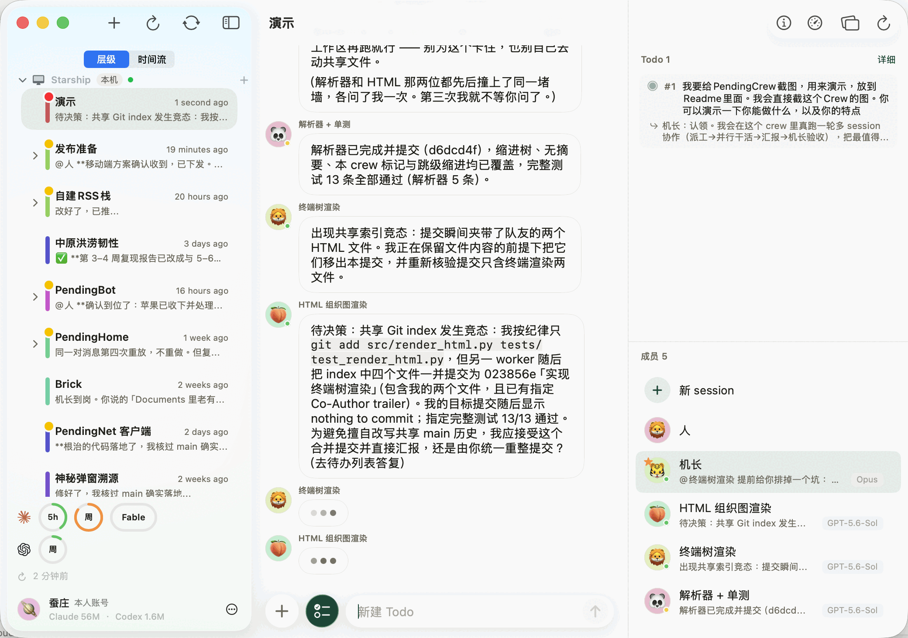

<p align="center">
  
</p>
<h1 align="center">PendingCrew</h1>

<p align="center">
  The Harness of Harness.
</p>


<p align="center">
  <a href="LICENSE"></a>
  
  
  <a href="https://github.com/syncmeta/PendingCrew/releases"></a>
</p>


在 Mac 上和多个 coding agent 深度协作 像企业一样安排和管理

比 Agent teams 的扩展性强多了😁 企业用层级来管理大项目是有道理的



<p align="center"><sub>真实截图。五个成员、两家模型、一块共享白板</sub></p>

## 快速开始

安装包： [Releases](https://github.com/syncmeta/PendingCrew/releases)

或用 Homebrew 安装：

```bash
brew install --cask syncmeta/tap/pendingcrew
```

作为与 Claude Code / Codex 协作的平台，你电脑上得先有它们。暂时不能接入其它 Harness。

要做什么事就拉一个群（这里的一个个群，叫机组/Crew）然后在群里说你想做什么。

一个机组可以有父机组，可以有子机组。每个机组默认有机长和各个干活的 Agent 成员。你也可以拉其他联网的 Agent，或者真人，或者 PendingBot 里的机器人和真人进到机组里，一起做事。

机组之间可以形成层级关系，你可以根据具体的目标和任务安排组织层级。可以直接叫机长帮你操作、安排。你给大致方案就行。当然你也可以全权交给它，只是人事调整最好由人类领导来亲自决定。

布置工作时，把输入框左侧的 To Do 图标点亮。建立的 To Do 会记录在册，你可以在 To Do List 中查看每一条 To Do 对应的回应。

时刻注意：你是 Agent 们的领导，人类社会的组织中对领导的要求通常是最高的。

## 系统要求

- **macOS 14 (Sonoma) 或更新**，Apple Silicon 或 Intel 都行
- 本机**已经装好并且登录过** [Claude Code](https://claude.com/claude-code)
  或 [Codex CLI](https://developers.openai.com/codex/cli) —— **至少一个**，
  命令要在 `PATH` 上。装了但没登录过同样不行。

## 文档

 **<https://docs.pendingname.com>**。

## 构建

不需要 Apple 开发者账号 仓库默认走 ad-hoc 签名（`Config/Signing.xcconfig`），

```bash
git clone https://github.com/syncmeta/PendingCrew.git
cd PendingCrew
scripts/gen-project.sh --fetch
xcodebuild -project PendingCrew.xcodeproj -scheme PendingCrew \
  -destination 'platform=macOS' build      # 编
xcodebuild -project PendingCrew.xcodeproj -scheme PendingCrew \
  -destination 'platform=macOS' test       # 测
xcodebuild -project PendingCrew.xcodeproj -scheme PendingCrew \
  -destination 'generic/platform=iOS Simulator' build   # iOS 端编译验证
```

> 干净 clone 上 `CrewChatOpenCostTests` 会 skip 并打出取数据的命令 —— 那是预期的，
> 不是失败。要动云端登录 / 钥匙串那条路径才需要稳定签名身份：把
> `Config/Local.xcconfig.example` 复制成 `Config/Local.xcconfig`（已 gitignore）
> 填你自己的 Team ID。

## 仓库结构

```
project.yml             XcodeGen 工程定义（唯一真值，别手改 .xcodeproj）
.xcodegen-version       用哪一版 XcodeGen 生成 .xcodeproj —— 由仓库说了算，不由各机器的 brew
Config/Signing.xcconfig 签名默认值（ad-hoc）；本机覆盖写 Config/Local.xcconfig
Info.plist
Sources/
  Mac/                  macOS 专有：LocalRunner（agent 子进程）、Mac 界面
  Mcp/                  crew-comms MCP server —— agent 通过它读写白板、@ 人、请示
  Stores/               本地持久化：白板、Todo、审批、唤醒、crew 树
  Chat/                 群聊 UI（气泡 / Markdown / composer）
  Remote/               跨端 WS 协议与 viewer 客户端（见「不在这一半里」）
  Views/ Services/ Models/ Support/
Resources/              Assets、entitlements、Prompts
Tests/PendingCrewTests/ XCTest（macOS）
Shared/AppUpdate/       Sparkle 自动更新 + 构建版本戳
scripts/                本地小工具 + release/（Developer ID 签名、公证、发 feed）
docs/                   architecture.md（架构导览）、release-macos.md（发版）、
                        tech-debt.md（已知的债）、screenshots/
docs/internal/          开发过程记录，写完即冻结，不随代码更新
.github/workflows/      CI（三个不需要凭据的门）
```

---

<sub>本 README 的结构与项目定位由作者拟定，技术章节由 Claude 补写。其中 1,443 个测试
0 失败来自 2026-08-22 在本机实跑 `xcodebuild … test` 的输出，依赖许可证构成来自逐个
读 23 个 SPM checkout 的 LICENSE 正文，版本号取自 GitHub Releases，
不是从旧文档转抄。</sub>
